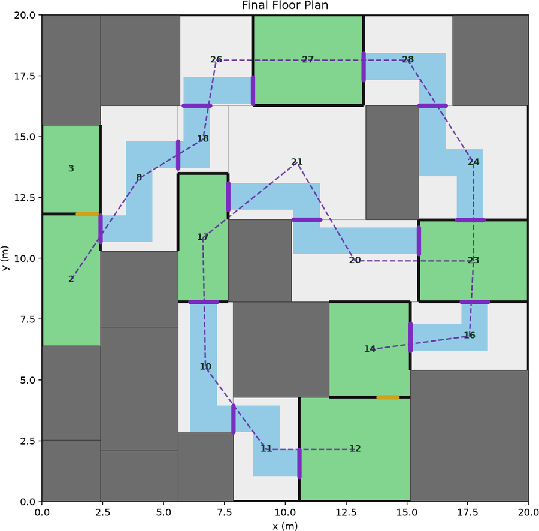
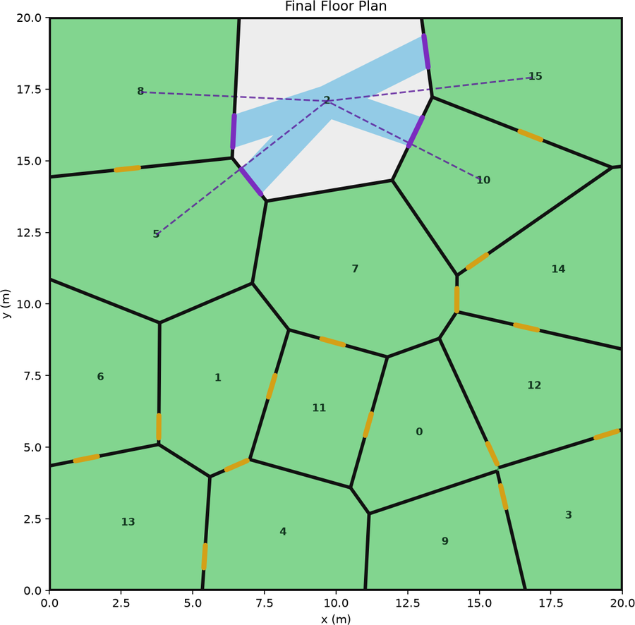
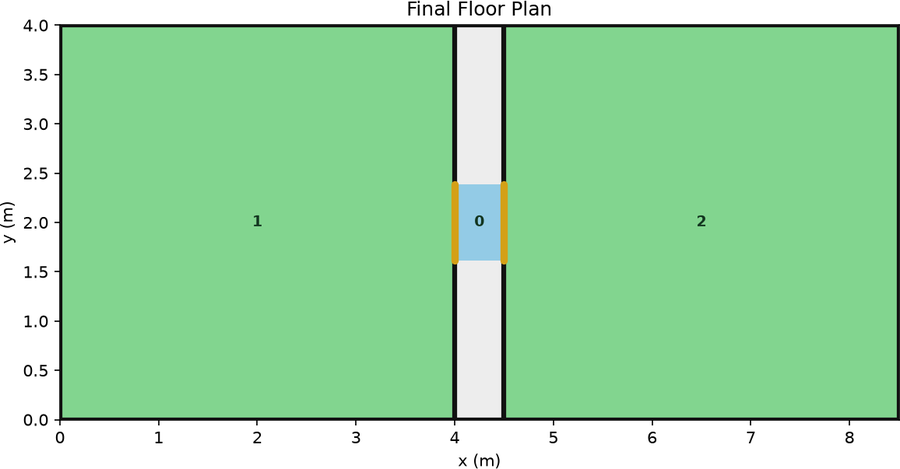
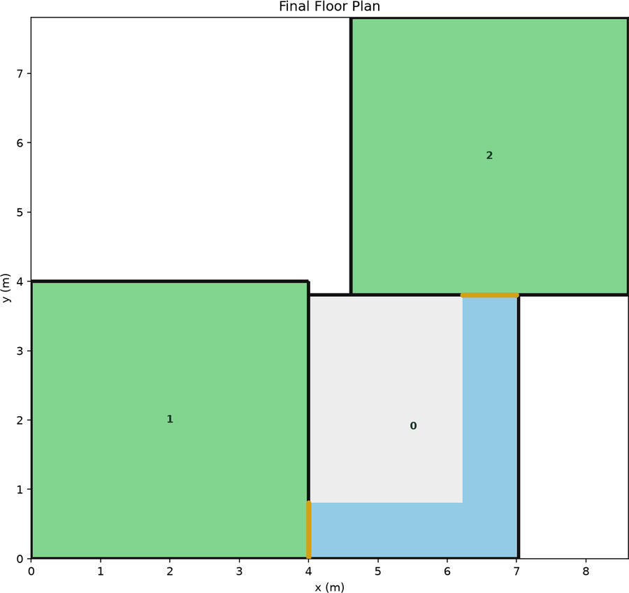
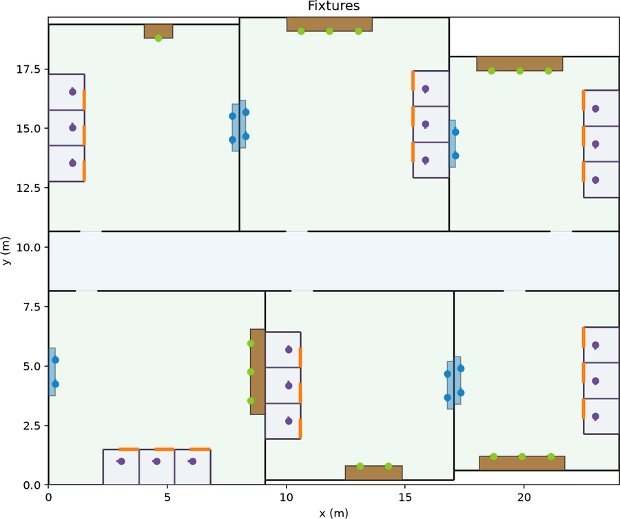

# random-gazebo-world

Procedural Gazebo world generator for flat indoor navigation experiments.

The generator builds one-level indoor worlds from room-like cells connected by door
**gates** and corridor **passages**. Every run exports a Gazebo/SDFormat world, a Nav2
occupancy map, deterministic start/goal metadata, layout JSON, and staged debug images
— see [Generated outputs](#generated-outputs).

## Modes

Five layouts, selected by `layout_mode` (plus `partition_method` inside `partition`).
Each links to its own chapter with a runnable command.

| Mode | Config key | What it generates | In autotuner | Preview |
| --- | --- | --- | --- | --- |
| [**BSP partition**](#bsp-partition) | `layout_mode: partition`<br>`partition_method: bsp` | Recursive axis-aligned splits into rooms, gates and routed passages. The general-purpose mode. | **Everything that runs today.** Exploration (`bsp_rooms`, room-count axis; `bsp_rooms_fixed_area`, AUT-185) and both random narrow-passage scenarios (`two_room_gate`, `two_room_corner` — 2-room BSP worlds despite the names). |  |
| [**Voronoi partition**](#voronoi-partition) | `layout_mode: partition`<br>`partition_method: voronoi` | Lloyd-relaxed Voronoi cells — non-orthogonal rooms and angled walls. | **None — do not use yet.** Leftover space exports as OBJ meshes with absolute `file://` URIs, which a containerized sim cannot resolve. AUT-144 open; never validated in Gazebo or a trial. |  |
| [**Two-room gate**](#two-room-gate) | `layout_mode: two_room_gate` | Two fixed square rooms sharing a divider with one centred gate. Geometry is exact, not sampled. | `narrow_passage_fixed_gate` (config `two_room_gate_fixed`) — the deterministic gate-width axis, where a random layout would confound the measurement. |  |
| [**Two-room corner**](#two-room-corner) | `layout_mode: two_room_corner` | Two fixed rooms joined by an L-shaped passage of two independently-sized legs. | `narrow_passage_fixed_corner` (config `two_room_corner_fixed`) — the deterministic corner-width axis. |  |
| [**Corridor**](#corridor) | `layout_mode: corridor` | A fixed-length corridor with rooms tiled along both sides, one entrance each — plus restroom fixtures, textures, point lighting and ODE physics. | **None.** The only mode with fixtures, and the one used for hand-installed TCR sim worlds — see [Using a generated world in the TCR simulation](#using-a-generated-world-in-the-tcr-simulation). |  |

Previews are `debug/10_final_floorplan.png` for the four partition/two-room modes and
`debug/12_fixtures.png` for corridor, from the commands in each chapter. Green = rooms,
blue = passages, orange = gates, dark grey = unused solid fill.

**Fixtures exist in exactly one shape.** `fixture_mode: restroom_clusters` is the only
non-`none` value there is, and only [`configs/corridor.yaml`](configs/corridor.yaml)
ships with it enabled and tuned. Config validation rejects it outright on `voronoi` and
on both two-room modes; it loads on `bsp`, but no packaged config or downstream consumer
uses that combination. Treat fixtures as a corridor-mode feature. There is no support for
general furniture or semantic object placement.

## Setup

Python `>=3.12` and `uv`. From the repository root:

```bash
uv sync
```

Every mode below uses the same single command:

```bash
uv run python -m random_gazebo_world.cli generate --config <yaml> --out <dir> [--seed <int>]
```

`--out` is removed and rewritten on each run. `--seed` overrides the config's
`random_seed`; omit it to use the YAML value. The exported world is named after the
output directory — `--out outputs/world_42` writes `outputs/world_42/world_42.sdf`.

For Gazebo validation and the Nav2 demo you also need ROS 2 Jazzy, Gazebo Sim 8 from the
ROS Jazzy vendor packages, Nav2 bringup and simple commander, and TurtleBot3 minimal sim
packages. On this WSL2 machine `gz` comes from the vendor path:

```bash
source /opt/ros/jazzy/setup.bash
export PATH=/opt/ros/jazzy/opt/gz_tools_vendor/bin:$PATH
```

---

### BSP partition

The default and the only mode with downstream users. Recursive axis-aligned splits
produce cells between `min_cell_size` and `max_cell_size`; a subset is selected as rooms,
a randomized spanning tree (plus `extra_loop_probability` loops) picks which rooms
connect, and unused cells become routed passages or solid fill.

```bash
uv run python -m random_gazebo_world.cli generate \
  --config configs/default.yaml \
  --seed 42 \
  --out outputs/readme_bsp
# preview: outputs/readme_bsp/debug/10_final_floorplan.png
```

| Key | Effect |
| --- | --- |
| `world_width`, `world_height` | World extent in metres. |
| `min_cell_size`, `max_cell_size` | BSP cell size range — the room-scale knob. |
| `min_room_count`, `max_room_count` | How many cells become rooms. Set both equal to pin it. |
| `gate_width_min/max` | Room-to-room opening width. The narrow-passage difficulty axis. |
| `passage_width_min/max` | Corridor strip width through passage cells. |
| `extra_loop_probability` | Chance of adding loop edges beyond the spanning tree. |
| `passage_geometry_mode` | `curved` (default) or `legacy_orthogonal`. `legacy_orthogonal` requires `bsp`. |

BSP is the only mode that produces pure box geometry at low room counts, which is why it
is the one that runs in a container without extra path plumbing. Worlds with
`room_count: 8` have been seen to emit OBJ meshes for concave leftovers — autotuner's
exploration scenario sets `mesh_uri_path_map` for exactly that case.

### Voronoi partition

Same partition pipeline, Voronoi cells instead of BSP splits: `voronoi_seed_count` sites
relaxed by `voronoi_lloyd_iterations` of Lloyd's algorithm, keeping cells within
`voronoi_min_cell_area` / `voronoi_max_cell_area`.

```bash
uv run python -m random_gazebo_world.cli generate \
  --config configs/voronoi.yaml \
  --seed 42 \
  --out outputs/readme_voronoi
# preview: outputs/readme_voronoi/debug/10_final_floorplan.png
```

**Do not use this mode for measurements yet — AUT-144 is open.** What is actually true as
of 2026-08-15, having run it:

- Generation succeeds and is deterministic; `gz sdf -k` reports the exported world
  `Valid.` on every seed tried (42, 1, 2, 3, 7, 11).
- **Every** voronoi world exports non-orthogonal leftovers as OBJ meshes under `meshes/`,
  referenced from the SDF as absolute host paths:
  `<uri>file:///home/you/worldgen/outputs/.../meshes/solid_0.obj</uri>`. BSP worlds at the
  packaged room counts emit none.
- A sim that does not share that host path — anything containerized — cannot resolve the
  URI. Gazebo's response is to log `Error Code 14`, fail to load the world, and **exit 0**,
  so the only symptom is a readiness timeout blamed on the wrong stage.
- Nothing has ever brought a robot up in a voronoi world. "Valid SDF" is not that.

Two keys must move with `partition_method: voronoi`: `passage_geometry_mode: curved`
(`legacy_orthogonal` is bsp-only) and `fixture_mode: none` (validation rejects
`restroom_clusters` on voronoi). [`configs/voronoi.yaml`](configs/voronoi.yaml) sets both.

### Two-room gate

Two fixed `room_size` squares separated by a divider of `divider_thickness` with a single
centred opening of exactly `gate_width`. Nothing is sampled — the same seed and config
give the same walls to the millimetre, and the seed only moves the start/goal jitter.

```bash
uv run python -m random_gazebo_world.cli generate \
  --config configs/two_room_gate.yaml \
  --seed 42 \
  --out outputs/readme_two_room_gate
# preview: outputs/readme_two_room_gate/debug/10_final_floorplan.png
```

| Key | Effect |
| --- | --- |
| `room_size` | Edge length of each square room in metres. |
| `gate_width` | Exact opening width — the difficulty axis. |
| `divider_thickness` | Depth of the wall between the rooms, so the gate is a short tunnel rather than a hole. |
| `start_jitter_*`, `goal_jitter_*` | Seeded jitter on the sampled start/goal poses (x, y, yaw degrees). Zero in this config. |

`fixture_mode` must be `none`; config validation raises `ConfigError` otherwise. The point
of this mode is that geometry is not a variable, so an autotuner benchmark sweeping
`gate_width` is measuring the gate and nothing else.

### Two-room corner

Two fixed rooms joined by an L-shaped passage. Each leg is sized independently
(`leg_a_width`/`leg_a_length`, `leg_b_width`/`leg_b_length`), so the robot must clear a
right-angle turn between two constrictions rather than drive straight through one.

```bash
uv run python -m random_gazebo_world.cli generate \
  --config configs/two_room_corner.yaml \
  --seed 42 \
  --out outputs/readme_two_room_corner
# preview: outputs/readme_two_room_corner/debug/10_final_floorplan.png
```

| Key | Effect |
| --- | --- |
| `room_size` | Edge length of each square room in metres. |
| `leg_a_width`, `leg_a_length` | First leg of the L: constriction width and how far it runs. |
| `leg_b_width`, `leg_b_length` | Second leg, sized independently of the first. |
| `start_jitter_*`, `goal_jitter_*` | Seeded start/goal pose jitter. |

Same determinism and same `fixture_mode: none` rule as the gate mode.

### Corridor

Packs rooms along a fixed-length corridor aligned with +X. Each side is tiled
independently with rescaled room widths and jagged per-room depths; every room gets one
fixed-width entrance onto the corridor, and the corridor ends are closed by exterior
walls. This is the only mode that carries fixtures, textures, point lighting and ODE
physics, and the only one that goes into the TCR sim by hand.

```bash
uv run python -m random_gazebo_world.cli generate \
  --config configs/corridor.yaml \
  --seed 4242 \
  --out outputs/readme_corridor
# preview: outputs/readme_corridor/debug/12_fixtures.png
```

[`configs/corridor.yaml`](configs/corridor.yaml) is the reference config. Copy it and
adjust; after each change regenerate with a fixed `--seed` so differences come from your
edits rather than random variation, and read the debug images before loading Gazebo.

#### Layout and walls

| Key | Effect |
| --- | --- |
| `corridor_length` | Exact corridor extent along +X in metres. |
| `corridor_width` | Corridor width in metres. |
| `entrance_width` | Fixed width of each room-to-corridor opening. Must satisfy `room_width_min >= entrance_width + 2 * wall_thickness`. |
| `room_width_min`, `room_width_max` | Sampled room width range before tiling each corridor side. |
| `room_depth_min`, `room_depth_max` | Per-room depth range (jagged depths along the corridor). |
| `wall_height`, `wall_thickness` | Global wall dimensions in metres. |

Check `debug/01_partition` for room tiling, `debug/07_openings` for entrance placements,
and `debug/08_wall_segments` for the wall layout.

#### Fixtures

| Key | Effect |
| --- | --- |
| `fixture_mode` | `none` (default) or `restroom_clusters` — the only two values. |
| `fixture_models_dir` | Directory of fixture mesh assets; required when `fixture_mode` is not `none`. Meshes are referenced as `model://<subdir>/<file>.obj` URIs on the Gazebo resource path. |
| `fixture_toilet_count_min/max` | Toilets per toilet cluster (pitch `1.5` m). Defaults `2` / `5`. |
| `fixture_urinal_count_min/max` | Urinals per urinal cluster (pitch `1.0` m). Defaults `2` / `5`. |
| `fixture_basin_count_min/max` | Basins per basin cluster (pitch `1.2` m). Defaults `1` / `3`. |
| `fixture_<kind>_offset_x/y/z/yaw` | Local mesh visual origin compensation per fixture kind (metres/radians in the fixture frame). Defaults: toilet x `-0.458`, all others zero. |
| `cubicle_door_width` | Front-door opening width for each toilet cubicle (default `0.65` m). Must leave a front wall segment at least `wall_thickness` wide within the `1.5` m toilet pitch. |
| `cubicle_wall_height` | Optional cubicle partition height (default: use global `wall_height`). When set, must be positive and `<= wall_height`. |
| `counter_specular` | RGB specular for counter-top fixture visuals (default `[0.4, 0.4, 0.4]`). |
| `fixture_friction_mu` | ODE friction `mu`/`mu2` for counter and cabinet collisions (default `10000.2`). |

**Feasibility rule:** at config load, each kind's `count_min * pitch` must fit on the
largest possible room wall span: `max(room_width_max, room_depth_max) - 2 *
wall_thickness`. If the range is infeasible, loading the config raises `ConfigError` with
guidance to lower `fixture_<kind>_count_min` or increase `room_width_max` /
`room_depth_max`. This fails fast before generation starts.

Each toilet cubicle is an enclosed mini-room with side/end partitions and a fixed-width
front door. Partition walls merge into the wall layout for map/SDF export. Map occupancy
is stamped from fixture/box collision footprints, not whole cluster footprints; cubicle
interiors stay navigable except where partitions and fixtures occupy space.

Check `debug/12_fixtures` for cluster placement, cubicle outlines, door spans, and
fixture markers.

#### Appearance and physics

| Key | Effect |
| --- | --- |
| `textures_enabled` | When `true`, export procedural floor tiles, wall paint, and skirting (default `false`). Writes `floor_texture.png` next to the world SDF (64 pixels per metre, seeded from `random_seed`). |
| `floor_tile_size` | Floor tile edge length in metres (default `0.5`). |
| `cubicle_wall_color` | RGB laminate color for cubicle partitions when textures are enabled (default `[0.36, 0.47, 0.55]`). |
| `lighting_mode` | `directional` (default) uses sun/fill lights; `point` places shadowed room lights and spaced corridor lights. |
| `light_height` | Z height in metres for point lights (default `2.2`). |
| `corridor_light_spacing` | Spacing in metres for non-shadowed passage/corridor point lights (default `8.0`; at least one light per passage cell). |
| `scene_ambient` | World scene ambient RGB (default `[0.28, 0.28, 0.28]`). |
| `scene_background` | World scene background RGB (default `[0.7, 0.7, 0.7]`). |
| `physics_profile` | `ignored` (default) keeps lightweight ignored physics; `ode` exports Ignition/Gazebo ODE plugins and solver settings. Use `ode` for robot simulation in TCR. |

Painted perimeter walls receive skirting strips when textures are enabled; laminate
cubicle partitions do not.

---

## Seeds and retries

Generation is deterministic for a given base seed and successful attempt index. The
pipeline retries with incremented seeds when a stage fails validation: attempt `n` uses
`random_seed + n`. The winning seed is recorded in `metadata.json`.

| Key | Effect |
| --- | --- |
| `random_seed` | Base seed. |
| `max_attempts` | Top-level generation retry cap (default `100000`). |
| `max_selection_attempts` | Room-graph selection retry cap per generation attempt, partition mode only (default `64`). |

If generation exhausts `max_attempts`, the CLI exits with an error. Lower
`fixture_*_count_min` or relax layout bounds if retries cluster on fixture or corridor
layout failures.

## Generated outputs

```text
outputs/world_42/
  world_42.sdf       # named after the output directory, not "world.sdf"
  map.png            # Nav2 occupancy image
  map.yaml           # Nav2 map metadata, origin [0, 0, 0]
  nav_task.json      # deterministic start/goal
  layout.json        # detailed generated layout geometry
  metadata.json      # seed, config, counts, free_space, selected start/goal
  debug/             # staged SVG/PNG debug views
  floor_texture.png  # generated floor albedo when textures_enabled
  meshes/            # OBJ meshes for non-orthogonal solid fills (when present)
```

Fixture mesh assets are **not** copied into the output directory. Mesh fixture visuals
reference `model://<subdir>/<file>.obj` URIs resolved from `fixture_models_dir` on the
Gazebo resource path (`GZ_SIM_RESOURCE_PATH` / `IGN_GAZEBO_RESOURCE_PATH`). The floor
texture is referenced as the bare filename `floor_texture.png` relative to the world SDF;
Gazebo resolves it from the output directory when that directory is on the resource path
or when launching from it.

Solid-fill meshes under `meshes/` are different: they are written into the SDF as
**absolute** `file://` paths, which is the voronoi caveat above and the reason autotuner's
exploration scenario carries a `mesh_uri_path_map`.

The main Gazebo model structure is:

- `ground`: static box slab with top at `z = 0`
- `walls`: static model containing wall boxes plus solid fill geometry
- one static model per restroom fixture instance and per counter/cabinet box (when `fixture_mode` is enabled)
- point or directional lights depending on `lighting_mode`
- ODE physics plugins when `physics_profile: ode`

The exporter writes static models using the SDF element form (`<static>true</static>`)
rather than the older `static="true"` attribute, which avoids Gazebo warnings. The default
world *name* inside the SDF is `generated_world`; rename it when installing into another
package.

## Ground-truth free-space contract

Stable occupancy-map semantics for AUT-145 and downstream Nav2/benchmark consumers. Every
successful run exports `map.png`, `map.yaml`, and (when the map stage completes) a
matching `metadata.json` `free_space` block through the shared `export_occupancy_map` path
in `random_gazebo_world/export_map.py`.

### `map.png`

- Pixel value **`0`** = occupied (walls, solid fills, fixture collision footprints).
- Pixel value **`254`** = free (walkable room and passage interior).
- **Row 0 is the top** of the image (maximum world +Y); columns increase with world +X.
  Matches Nav2 map-server image orientation.

### `map.yaml`

| Field | Value |
| --- | --- |
| `image` | `"map.png"` |
| `resolution` | Metres per pixel from config `map_resolution` |
| `origin` | `[0, 0, 0]` (world origin at the bottom-left corner of the map image) |
| `negate` | `0` |
| `occupied_thresh` | `0.65` |
| `free_thresh` | `0.196` |

Grid dimensions in pixels: `width = ceil(world_width / resolution)`,
`height = ceil(world_height / resolution)`.

### `metadata.json` → `free_space`

```json
"free_space": {
  "free_cells": <int>,
  "free_area_m2": <float>,
  "resolution": <float>,
  "map_image": "map.png"
}
```

`free_area_m2 = free_cells * resolution²`.

This contract is the **M6 gate** for `partition_method: bsp`. It is designed to
generalize: `voronoi`, `corridor`, `two_room_gate`, and `two_room_corner` layouts honor
the same export path and produce maps conforming to these semantics.

## Debug images

Staged images under `debug/`. All stages except `09_occupancy_map_preview` produce both
`.svg` and `.png`; stage 09 is PNG only.

| Stage | Shows | Tuning use |
| --- | --- | --- |
| `01_partition` | Generated cells | Corridor room tiling and cell boundaries. |
| `02_selected_rooms` | Rooms vs unused cells | Which cells become navigable rooms. |
| `03_cell_adjacency_graph` | Cell adjacency graph | Topology before connection selection. |
| `04_candidate_connections` | Candidate gates/passages | Available gate and passage options (partition mode). |
| `05_selected_room_graph` | Final selected room connectivity | Chosen room graph (partition mode). |
| `06_passage_cells` | Cells reclassified as passages | Passage routing after connection apply. |
| `07_openings` | Doorway/gate placements | Entrance and gate widths on shared boundaries. |
| `08_wall_segments` | Generated wall segments | Wall layout before fixtures and solids. |
| `09_occupancy_map_preview` | Nav2 map preview (PNG only) | Free space for Nav2 and robot spawn selection. |
| `10_final_floorplan` | Composite floorplan | Overall layout; pick spawn coordinates in world frame. **The preview for every mode except corridor.** |
| `11_passage_geometry` | Corridor strips and solid leftovers | Passage strip geometry and solid fills. |
| `12_fixtures` | Restroom clusters, cubicle outlines, fixture markers | Fixture cluster placement — **the corridor preview**; an empty overlay when fixtures are disabled. |

## Validate and view in Gazebo

```bash
source /opt/ros/jazzy/setup.bash
export PATH=/opt/ros/jazzy/opt/gz_tools_vendor/bin:$PATH

gz sdf -k outputs/world_42/world_42.sdf     # schema check
gz sim outputs/world_42/world_42.sdf        # static geometry only
```

`gz sdf -k` checks the schema and nothing else — it does not resolve mesh URIs, so it
passes on worlds a containerized Gazebo cannot load. It is not evidence that a world works.

The raw generator SDF is static geometry. For a robot simulation with physics, sensors and
scene broadcaster plugins, use the demo augmentation step:

```bash
uv run python demo/scripts/augment_world.py outputs/world_42/world_42.sdf
gz sim outputs/world_42/world_42_nav.sdf
```

Corridor configs with `physics_profile: ode` already include ODE physics and
Ignition/Gazebo system plugins and can be used directly in TCR without augmentation.

## Using a generated world in the TCR simulation

Installs a generated corridor world into the TCR Ignition stack so the robot can be
spawned and navigated in it. (Autotuner does this automatically for its own scenarios;
this is the by-hand path.)

### 1. Copy the world SDF

```bash
cp outputs/readme_corridor/readme_corridor.sdf \
  ~/tcr/ros_ws/src/utils/tcr_ignition/worlds/my_world.sdf
```

Existing examples in that folder include `corridor_1.sdf` and `gen_42.sdf`.

### 2. Match the world name to the filename

The launch file resolves worlds as `<world_name>.sdf` under the package `worlds/`
directory, so the `<world>` element must match the filename without `.sdf`:

```xml
<!-- before -->              <!-- after -->
<world name="generated_world">   <world name="my_world">
```

### 3. Copy the floor texture

When `textures_enabled` is `true`:

```bash
cp outputs/readme_corridor/floor_texture.png \
  ~/tcr/ros_ws/src/utils/tcr_ignition/worlds/
```

The SDF references it by relative filename (`<albedo_map>floor_texture.png</albedo_map>`).
**Caveat:** if several generated worlds with different textures coexist in `worlds/`,
rename each texture (for example `my_world_floor.png`) and update the `<albedo_map>` in
the corresponding SDF — a single shared `floor_texture.png` is overwritten by the last copy.

### 4. Fixture meshes on the resource path

Fixture mesh visuals use `model://` URIs. The TCR Ignition launch file adds the package
`models/` directory to `GZ_SIM_RESOURCE_PATH` (and `IGN_GAZEBO_RESOURCE_PATH`). Point
`fixture_models_dir` at that directory:

```yaml
fixture_models_dir: ~/tcr/ros_ws/src/utils/tcr_ignition/models
```

No extra resource-path setup is needed when launching through TCR.

### 5. Point the tmuxp sim config at the new world

In `~/tcr/ros_ws/tmuxp/tcr_sim.yaml`, **Robot Bringup** pane, change `world:=` to the new
world name (filename without `.sdf`):

```yaml
ros2 launch tcr_ignition t1_v2_ignition_full.launch.py world:=my_world
x:=1.0 y:=5.0 z:=0.1 yaw:=1.57
headless:="${SIM_HEADLESS:-false}" gui:="${SIM_GUI:-true}" use_ground_truth_odom:=true
```

### 6. Choose a robot spawn pose

Use generator outputs to pick reachable coordinates:

- **`nav_task.json`** — a sampled reachable `start` pose (`x`, `y`, `yaw`) and matching `goal`.
- **`debug/09_occupancy_map_preview.png`** — Nav2 occupancy preview; white is free space in
  map coordinates (origin `[0, 0, 0]`).
- **`debug/10_final_floorplan`** — composite floorplan in the same coordinate frame as the world.

Set `z:=0.1` for spawn height. Adjust `x`, `y`, `yaw` to a free corridor or room location
away from fixtures and walls.

### 7. Rebuild and launch

```bash
cd ~/tcr/ros_ws
colcon build --packages-select tcr_ignition
source install/setup.bash

cd ~/tcr
ros_ws/bash/start_sim_tmuxp.sh
```

Use `--detached` to load the tmuxp session in the background.

## Generator pipeline

The pipeline branches on `layout_mode`: `partition` runs BSP or Voronoi partitioning, room
selection and topology-driven passages; `corridor` builds a corridor-centric layout
directly; the two two-room modes build fixed geometry. All of them then reuse the same
walls/map/SDF/metadata export stages.

1. **Partition / corridor layout**: create cells and roles.
2. **Adjacency graph**: build edges where cells share boundaries.
3. **Room selection**: mark selected cells as rooms (corridor mode selects all side rooms).
4. **Candidate connections**: create gate candidates (partition mode also adds passage candidates through unused cells).
5. **Room graph selection**: choose a randomized spanning tree plus optional loop edges (partition mode only).
6. **Apply connections**: reclassify corridor cells and record logical openings.
7. **Passage constraints**: reject topologies that violate opening constraints (partition mode only).
8. **Openings**: place concrete doorway/gate widths on shared boundaries.
9. **Passage geometry**: build straight / L / Z corridor strips in passage cells (partition mode; corridor mode uses the full corridor cell polygon).
10. **Solid fills**: convert unused space and passage leftovers into SDF geometry.
11. **Walls**: emit thin wall segments around rooms and passage boundaries.
12. **Fixtures** (optional): place restroom clusters and merge cubicle partitions into walls.
13. **Map export**: rasterize walkable geometry into a Nav2 map and write `debug/09_occupancy_map_preview.png`.
14. **Task sampling**: choose deterministic, reachable start/goal poses.
15. **SDF export**: write ground, walls, solids, fixtures, lighting, and meshes.
16. **Metadata/debug**: write JSON outputs and remaining staged debug images.
17. **Validation/retry**: retry with incremented seeds when generation fails.

### Cell roles

| Role | Walkable on map | SDF geometry |
| --- | --- | --- |
| Room | Full cell interior | Perimeter walls with gate openings |
| Passage | Corridor strips only | Corridor walkable area plus solid leftover fills |
| Unused | No | Full-cell solid fill |

Gates connect two adjacent rooms through their shared boundary. Passages route through
cells that were originally unused. Each passage cell gets one or more axis-aligned
corridor strips between openings; leftover area becomes solid.

## Configuration reference

Reference configs: [`default.yaml`](configs/default.yaml) (BSP),
[`voronoi.yaml`](configs/voronoi.yaml), [`two_room_gate.yaml`](configs/two_room_gate.yaml),
[`two_room_corner.yaml`](configs/two_room_corner.yaml),
[`corridor.yaml`](configs/corridor.yaml).

Partition-specific keys (`world_width`, `min_cell_size`, ...) are optional outside
partition mode and receive built-in defaults; each mode's own keys are required.

| Key | Default | Meaning |
| --- | --- | --- |
| `layout_mode` | `partition` | `partition`, `corridor`, `two_room_gate`, or `two_room_corner`. |
| `world_width` | `1.0` outside partition; required in partition | World extent along X. |
| `world_height` | `1.0` outside partition; required in partition | World extent along Y. |
| `corridor_length` | — | Exact corridor extent along +X (corridor mode, required). |
| `corridor_width` | — | Corridor width in metres (corridor mode, required). |
| `entrance_width` | — | Fixed room-to-corridor opening width (corridor mode, required). |
| `room_width_min`, `room_width_max` | — | Sampled room width range before tiling (corridor mode, required). |
| `room_depth_min`, `room_depth_max` | — | Per-room depth range (corridor mode, required). |
| `room_size` | — | Square room edge length (two-room modes, required). |
| `gate_width` | — | Exact gate opening (`two_room_gate`, required). |
| `divider_thickness` | — | Divider wall depth (`two_room_gate`, required). |
| `leg_a_width`, `leg_a_length` | — | First L leg (`two_room_corner`, required). |
| `leg_b_width`, `leg_b_length` | — | Second L leg (`two_room_corner`, required). |
| `start_jitter_x/y/yaw_deg` | `0.0` | Seeded jitter on the sampled start pose (two-room modes). |
| `goal_jitter_x/y/yaw_deg` | `0.0` | Seeded jitter on the sampled goal pose (two-room modes). |
| `partition_method` | `bsp` | `bsp` or `voronoi` (partition mode). |
| `passage_geometry_mode` | `legacy_orthogonal` for `two_room_gate`, else `curved` | `curved` or `legacy_orthogonal` (`legacy_orthogonal` requires `bsp`). |
| `min_cell_size`, `max_cell_size` | `1.0` / `10.0` outside partition; required in partition | BSP cell size range. |
| `voronoi_seed_count` | `16` | Number of Voronoi sites. |
| `voronoi_lloyd_iterations` | `8` | Lloyd relaxation iterations. |
| `voronoi_min_cell_area`, `voronoi_max_cell_area` | `1.0` / `64.0` | Accepted Voronoi cell area bounds. |
| `min_room_count`, `max_room_count` | `1` / `100` outside partition; required in partition | Room count range. |
| `gate_width_min`, `gate_width_max` | outside partition: `gate_width`, else `entrance_width`, else `0.8` / `1.2`; required in partition | Room-to-room opening width range. |
| `passage_width_min`, `passage_width_max` | outside partition: `gate_width`, else `leg_a_width`, else `1.0`; required in partition | Passage opening width range. |
| `max_openings_per_passage_edge` | `1` | Max openings allowed on one passage edge. |
| `max_open_edges_per_passage` | `4` | Max sides of a passage cell that may contain openings. |
| `extra_loop_probability` | `0.0` in corridor; required in partition | Probability of adding extra room-graph loop edges. |
| `map_resolution` | — | Occupancy map resolution in metres per pixel (required). |
| `random_seed` | — | Base seed (required). |
| `max_attempts` | `100000` | Top-level generation retry cap. |
| `max_selection_attempts` | `64` | Room graph selection retry cap per attempt (partition mode). |
| `wall_height`, `wall_thickness` | — | Wall dimensions in metres (required). |
| `ground_thickness` | `0.1` | Ground slab thickness in metres. |
| `textures_enabled` | `false` | Procedural floor tiles, wall paint, and skirting. |
| `floor_tile_size` | `0.5` | Floor tile edge length in metres when textures are enabled. |
| `fixture_mode` | `none` | `none` or `restroom_clusters`. Rejected on `voronoi` and on both two-room modes. |
| `fixture_models_dir` | — | Directory containing fixture mesh assets; required when `fixture_mode` is not `none`. |
| `fixture_toilet_offset_x/y/z/yaw` | `-0.458` / `0` / `0` / `0` | Local mesh visual origin compensation for toilets. |
| `fixture_urinal_offset_x/y/z/yaw` | all `0` | Local mesh visual origin compensation for urinals. |
| `fixture_basin_offset_x/y/z/yaw` | all `0` | Local mesh visual origin compensation for basins. |
| `fixture_toilet_count_min`, `fixture_toilet_count_max` | `2` / `5` | Min/max toilets per toilet cluster (pitch `1.5` m). |
| `fixture_urinal_count_min`, `fixture_urinal_count_max` | `2` / `5` | Min/max urinals per urinal cluster (pitch `1.0` m). |
| `fixture_basin_count_min`, `fixture_basin_count_max` | `1` / `3` | Min/max basins per basin cluster (pitch `1.2` m). |
| `cubicle_door_width` | `0.65` | Width of the front-door opening for each toilet cubicle in metres. |
| `cubicle_wall_height` | — | Optional cubicle partition height (default: use global `wall_height`). |
| `cubicle_wall_color` | `[0.36, 0.47, 0.55]` | RGB laminate color for cubicle partitions when textures are enabled. |
| `lighting_mode` | `directional` | `directional` (sun/fill) or `point` (room and corridor point lights). |
| `light_height` | `2.2` | Z height in metres for point lights. |
| `corridor_light_spacing` | `8.0` | Spacing in metres for non-shadowed corridor point lights. |
| `scene_ambient` | `[0.28, 0.28, 0.28]` | World scene ambient RGB. |
| `scene_background` | `[0.7, 0.7, 0.7]` | World scene background RGB. |
| `physics_profile` | `ignored` | `ignored` or `ode` (ODE plugins and solver settings). |
| `counter_specular` | `[0.4, 0.4, 0.4]` | RGB specular for counter-top fixture visuals. |
| `fixture_friction_mu` | `10000.2` | ODE friction `mu`/`mu2` for counter and cabinet collisions. |

Per-type fixture offsets affect only mesh visual placement in SDF export. They do not
change fixture logical world poses or collision boxes.

## Repository layout

| Path | Purpose |
| --- | --- |
| `random_gazebo_world/` | Generator package: partitioning, topology, openings, walls, maps, SDF export. |
| `configs/` | One reference config per mode. |
| `docs/modes/` | Mode preview images used by this README. |
| `tests/` | Unit tests for geometry, topology, map/SDF export, and config behavior. |
| `demo/` | Automated Gazebo + Nav2 benchmark pipeline. |
| `outputs/` | Default local output area for generated worlds (gitignored). |

## Tests

```bash
uv run pytest tests -q -s
uv run worldgen-test              # package test entrypoint
```

The `-s` flag avoids capture-related issues seen in this WSL2 desktop session.

**Run these from a shell that has *not* sourced ROS.** `/opt/ros/jazzy` on `PYTHONPATH`
shadows the venv and collection dies at `ModuleNotFoundError: No module named 'lark'`,
which looks like a broken checkout and is not one. From a sourced shell, strip it:

```bash
env -u PYTHONPATH -u AMENT_PREFIX_PATH uv run pytest tests -q
```

## Nav2 benchmark demo

The demo lives in [`demo/`](demo/README.md): it generates TurtleBot3-scale worlds, runs
Nav2 profiles against them, records metrics, and applies a CI-style gate. Quick one-world
check:

```bash
source /opt/ros/jazzy/setup.bash
export PATH=/opt/ros/jazzy/opt/gz_tools_vendor/bin:$PATH
export LIBGL_ALWAYS_SOFTWARE=1

uv run python demo/orchestrate.py \
  --config demo/configs/turtlebot_nav.yaml \
  --seeds 10 --profiles curated \
  --out /tmp/worldgen_nav_check \
  --timeout 60 --wall-timeout 140 --launch-timeout 60 \
  --headless True --dds auto
```

In the current WSL2 environment, `--dds auto` detects a Fast-CDR ABI mismatch and switches
to CycloneDDS. See [demo/README.md](demo/README.md) for the full benchmark matrix,
reports, CI workflow, and runtime limitations — especially WSL2 DDS selection, slow
software-rendered Gazebo, and Gazebo server shutdown occasionally exiting `-11` after
results are already written.

## Known limitations

- Flat, one-level indoor environments only.
- **Voronoi is not usable downstream** — see [Voronoi partition](#voronoi-partition) and AUT-144.
- **Fixtures are restroom clusters in corridor worlds.** No other fixture kind exists, and
  no general furniture or semantic object placement is supported.
- Corridors are axis-aligned strips inside generated cells.
- Non-orthogonal solid fills are exported as OBJ meshes referenced by absolute path;
  orthogonal solids are decomposed to boxes where possible.
- The raw SDF with `physics_profile: ignored` is static geometry without simulation
  plugins. Use `physics_profile: ode` for TCR, or `demo/scripts/augment_world.py` for the
  Nav2 demo pipeline.
- The Nav2 demo is sensitive to ROS/Gazebo host setup (DDS, software GL, teardown).
